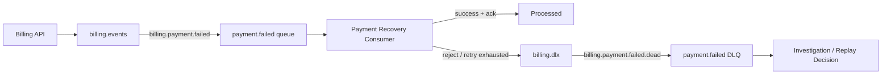

# Dead-Letter Queue Example

A dead-letter queue stores messages that could not be processed successfully by
the normal consumer flow.

DLQs are essential in production systems because they make failures visible and
recoverable instead of letting messages disappear or retry forever.

## Business Scenario

Imagine a billing system that consumes payment failure events.

The consumer may fail when:

- the payload is invalid;
- the customer no longer exists;
- an external payment recovery service is unavailable;
- the message has already been processed;
- the consumer code has a bug.

Some failures are temporary and can be retried. Others should be moved to a
dead-letter queue for investigation.

## Topology

```text
Exchange: billing.events
Type: direct

Queue: billing.payment.failed.queue
Routing key: billing.payment.failed

Dead-letter exchange: billing.dlx
Dead-letter queue: billing.payment.failed.dlq
Dead-letter routing key: billing.payment.failed.dead
```

## Message Flow



## Why DLQ Fits

Use a dead-letter queue when:

- failed messages need inspection;
- retries must have limits;
- invalid messages should not block the main queue;
- operations teams need a recovery path;
- failures should be visible through monitoring.

Avoid treating a DLQ as:

- a permanent trash can;
- a replacement for validation;
- a place where messages go without alerts;
- an excuse to ignore idempotency.

## Spring Boot Configuration Shape

```java
@Bean
DirectExchange billingEventsExchange() {
    return new DirectExchange("billing.events");
}

@Bean
DirectExchange billingDeadLetterExchange() {
    return new DirectExchange("billing.dlx");
}

@Bean
Queue paymentFailedQueue() {
    return QueueBuilder
            .durable("billing.payment.failed.queue")
            .deadLetterExchange("billing.dlx")
            .deadLetterRoutingKey("billing.payment.failed.dead")
            .build();
}

@Bean
Queue paymentFailedDeadLetterQueue() {
    return QueueBuilder.durable("billing.payment.failed.dlq").build();
}

@Bean
Binding paymentFailedDeadLetterBinding(
        Queue paymentFailedDeadLetterQueue,
        DirectExchange billingDeadLetterExchange
) {
    return BindingBuilder
            .bind(paymentFailedDeadLetterQueue)
            .to(billingDeadLetterExchange)
            .with("billing.payment.failed.dead");
}
```

## Consumer Behavior

A consumer should distinguish between:

- valid messages that processed successfully;
- temporary failures that can be retried;
- permanent failures that should be rejected;
- duplicate messages that should be safely ignored.

The important rule:

```text
do not acknowledge a message until the important work has succeeded
```

## Operational Checklist

For every DLQ, define:

- who monitors it;
- what alert threshold matters;
- how messages are inspected;
- when messages can be replayed;
- when messages should be discarded;
- how replay avoids duplicate side effects.

## Interview Talking Points

- A DLQ makes failed messages visible and recoverable.
- Retry policies need limits.
- Consumers should be idempotent before replaying messages.
- DLQ monitoring is part of observability.
- Not every failure should be retried forever.
