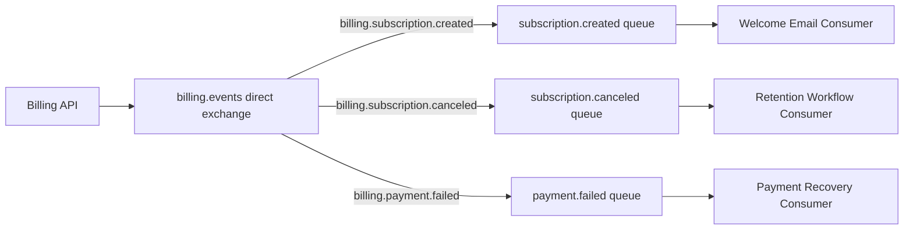

# Direct Exchange Example

A direct exchange routes messages to queues by exact routing key match.

This is one of the clearest RabbitMQ patterns for backend systems because the
producer can describe the event type through a routing key, and RabbitMQ sends
the message only to queues bound to that exact key.

## Business Scenario

Imagine a billing system that publishes subscription lifecycle events.

The system emits events such as:

- `billing.subscription.created`;
- `billing.subscription.canceled`;
- `billing.payment.failed`.

Each event can be handled by a different consumer without coupling the producer
to the consumer implementation.

## Topology

```text
Exchange: billing.events
Type: direct

Queue: billing.subscription.created.queue
Binding key: billing.subscription.created

Queue: billing.subscription.canceled.queue
Binding key: billing.subscription.canceled

Queue: billing.payment.failed.queue
Binding key: billing.payment.failed
```

## Message Flow



## Why Direct Exchange Fits

Use a direct exchange when:

- routing keys are known and specific;
- each message type has a clear destination;
- consumers should receive only the exact event they handle;
- routing should be explicit and easy to debug.

Avoid using direct exchange when:

- a message should be broadcast to many consumers;
- consumers need wildcard subscriptions;
- routing depends on complex headers.

## Spring Boot Configuration Shape

The topology can be represented with Spring AMQP beans:

```java
@Bean
DirectExchange billingEventsExchange() {
    return new DirectExchange("billing.events");
}

@Bean
Queue subscriptionCreatedQueue() {
    return QueueBuilder.durable("billing.subscription.created.queue").build();
}

@Bean
Binding subscriptionCreatedBinding(
        Queue subscriptionCreatedQueue,
        DirectExchange billingEventsExchange
) {
    return BindingBuilder
            .bind(subscriptionCreatedQueue)
            .to(billingEventsExchange)
            .with("billing.subscription.created");
}
```

## Producer Responsibility

The producer should:

- publish to the exchange;
- choose the correct routing key;
- serialize a stable event payload;
- include identifiers needed by consumers;
- avoid depending on consumer classes.

Example publishing intent:

```text
publish SubscriptionCreatedEvent to billing.events with routing key billing.subscription.created
```

## Consumer Responsibility

The consumer should:

- listen to one queue;
- validate the message;
- execute one focused workflow;
- acknowledge only after successful processing;
- log enough context for troubleshooting.

## Failure Considerations

Direct exchange routing is simple, but message processing can still fail.

Important questions:

- What happens if the consumer throws an exception?
- Should the message be retried?
- How many retries are acceptable?
- Where does the message go after retry exhaustion?
- Is the consumer idempotent?

These questions lead naturally to retry policies and dead-letter queues.

## Interview Talking Points

- Direct exchange uses exact routing key matching.
- Producers publish intent; consumers process queues.
- Explicit routing is easy to explain and debug.
- Direct exchange is a good first choice for clear command or event categories.
- Reliability still depends on acknowledgements, retries, and DLQs.
