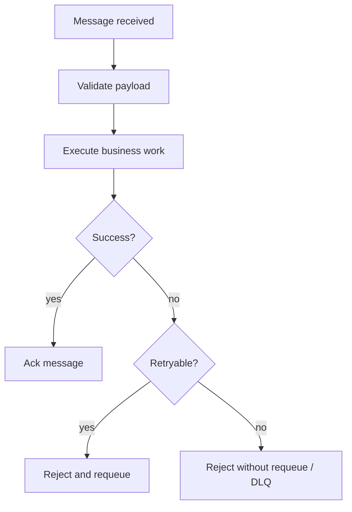

# Manual Acknowledgement

Manual acknowledgement gives the consumer control over when a message is marked
as processed.

## Why It Matters

If a consumer acknowledges a message before the important work succeeds, a
failure can cause data loss.

If a consumer never acknowledges a message, RabbitMQ may redeliver it and create
duplicate processing.

The safer rule is:

```text
ack only after the important work succeeds
```

## Basic Flow



## When Manual Ack Helps

Manual ack is useful when:

- message processing changes application state;
- external calls can fail;
- duplicate work is expensive;
- the consumer needs to decide between retry and DLQ;
- operational correctness matters.

## Consumer Responsibilities

A manually acknowledging consumer should:

- validate the message before work;
- execute the business action;
- acknowledge only after success;
- reject invalid messages without endless retries;
- log correlation ids and failure reasons;
- be idempotent when redelivery is possible.

## Interview Talking Points

- Acknowledgement is part of reliability design.
- Manual ack gives control but adds responsibility.
- Consumers should distinguish retryable and permanent failures.
- Idempotency protects against duplicate delivery.
- DLQs make failed messages visible.
