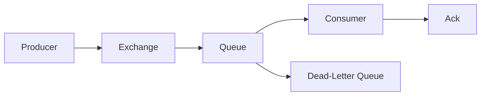

# Messaging Fundamentals

This document explains the RabbitMQ concepts that matter most when designing
message-driven backend systems.

## Producer

A producer is the application component that publishes a message.

In a backend system, producers often publish events such as:

- subscription created;
- payment failed;
- invoice generated;
- user registered;
- audit event recorded.

Good producers should:

- publish messages with clear intent;
- avoid sending unnecessary data;
- include correlation or trace identifiers when possible;
- not assume which consumer will process the message.

## Message

A message is the payload sent through RabbitMQ.

A good message should be:

- explicit;
- serializable;
- version-aware when the contract may evolve;
- small enough to move through the broker efficiently;
- meaningful without requiring hidden context.

Example event name:

```text
subscription.created
```

Example payload shape:

```json
{
  "eventId": "evt-123",
  "organizationSlug": "acme",
  "subscriptionId": "sub-456",
  "occurredAt": "2026-06-08T12:00:00Z"
}
```

## Exchange

An exchange receives messages from producers and routes them to queues.

RabbitMQ commonly uses these exchange types:

- `direct`: routes by exact routing key match;
- `fanout`: sends a copy to every bound queue;
- `topic`: routes by routing key patterns;
- `headers`: routes by message headers instead of routing key.

The exchange is important because it lets producers publish events without
knowing the final consumer implementation.

## Queue

A queue stores messages until consumers process them.

Queues are useful when:

- work can be processed asynchronously;
- consumers may be temporarily unavailable;
- load needs to be absorbed during traffic spikes;
- work should be retried after failure.

## Binding

A binding connects an exchange to a queue.

For a direct exchange, the binding usually says:

```text
Messages with routing key billing.subscription.created go to this queue.
```

For a topic exchange, the binding can use patterns:

```text
billing.subscription.*
```

## Routing Key

A routing key is metadata used by exchanges to decide where a message should go.

Good routing keys are:

- predictable;
- domain-oriented;
- stable enough for consumers;
- specific enough to avoid accidental routing.

Example routing keys:

- `billing.subscription.created`;
- `billing.subscription.canceled`;
- `billing.payment.failed`;
- `audit.organization.created`.

## Consumer

A consumer reads messages from a queue and performs work.

Good consumers should:

- validate message data;
- keep processing logic focused;
- handle failures explicitly;
- avoid assuming messages arrive only once;
- be idempotent when possible.

## Acknowledgement

An acknowledgement tells RabbitMQ that a message was processed.

If a consumer acknowledges too early, failed work may be lost.
If a consumer never acknowledges, messages may be redelivered forever.

The safer mental model is:

```text
acknowledge only after the important work succeeds
```

## Dead-Letter Queue

A dead-letter queue stores messages that could not be processed successfully.

DLQs are useful for:

- failed messages after retry limits;
- invalid payloads;
- expired messages;
- operational investigation.

Dead-lettering is not only an error bucket. It is a reliability pattern that
helps teams inspect and recover from failures.

## Basic Flow



## Interview Talking Points

- RabbitMQ decouples producers from consumers.
- Exchanges route messages; queues store messages.
- Retries need limits and observability.
- Consumers should be idempotent when duplicate processing is possible.
- Dead-letter queues help make failures visible instead of silent.
