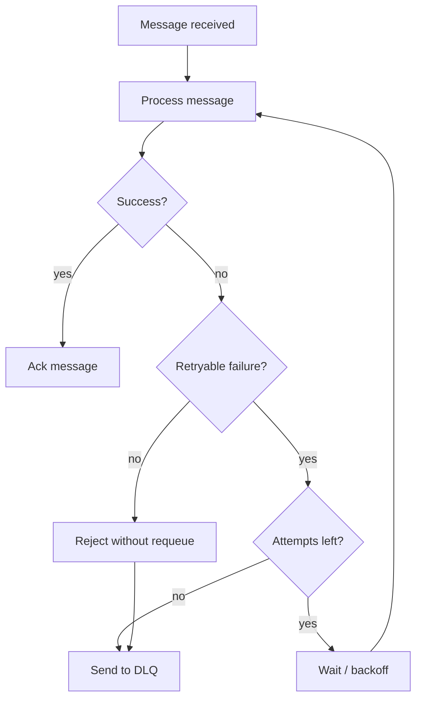

# Retry Strategy Example

Retry is the practice of trying message processing again after a failure.

In message-driven systems, retry must be designed carefully. Retrying forever
can overload dependencies, hide bugs, and block queues. Retrying with limits
can recover from temporary failures while still making permanent failures
visible.

## Business Scenario

Imagine a payment recovery consumer that receives this event:

```text
billing.payment.failed
```

The consumer calls an external payment recovery service.

The call may fail because:

- the external service is temporarily unavailable;
- the network times out;
- the payload is invalid;
- the customer no longer exists;
- the event was already processed.

Only some of these failures should be retried.

## Retry Decision Matrix

| Failure type | Retry? | Reason |
| --- | --- | --- |
| Network timeout | Yes | Usually temporary. |
| External service unavailable | Yes | Dependency may recover. |
| Invalid payload | No | Retrying will not fix the message. |
| Missing customer | Usually no | Requires data investigation. |
| Duplicate event | No | Consumer should handle idempotently. |
| Unexpected bug | Limited retry, then DLQ | Needs visibility after failure limit. |

## Recommended Flow



## Retry Policy Shape

A simple retry policy should define:

- maximum attempts;
- initial delay;
- backoff multiplier;
- maximum delay;
- which exceptions are retryable;
- what happens after attempts are exhausted.

Example policy:

```text
max attempts: 3
initial delay: 2 seconds
backoff multiplier: 2
max delay: 30 seconds
after final failure: dead-letter queue
```

## Spring AMQP Configuration Shape

Spring AMQP can apply retry behavior through listener container configuration.

```java
@Bean
SimpleRabbitListenerContainerFactory rabbitListenerContainerFactory(
        ConnectionFactory connectionFactory,
        SimpleRabbitListenerContainerFactoryConfigurer configurer
) {
    var factory = new SimpleRabbitListenerContainerFactory();
    configurer.configure(factory, connectionFactory);
    factory.setAdviceChain(RetryInterceptorBuilder
            .stateless()
            .maxAttempts(3)
            .backOffOptions(2_000, 2.0, 30_000)
            .recoverer(new RejectAndDontRequeueRecoverer())
            .build());
    return factory;
}
```

With this shape:

- retryable failures are attempted up to three times;
- delays grow between attempts;
- final failure is rejected;
- queue dead-letter configuration decides where the message goes next.

## Idempotency Requirement

Retry can cause the same message to be processed more than once.

Consumers should be idempotent when side effects matter.

Useful techniques:

- store processed event IDs;
- use natural unique constraints;
- make external calls with idempotency keys;
- check current state before changing it;
- design handlers so duplicate messages do not create duplicate side effects.

## What To Log

For each failed attempt, log:

- event id;
- routing key;
- queue name;
- attempt number;
- failure class;
- correlation id when available.

Avoid logging:

- passwords;
- tokens;
- full customer payment data;
- secrets from environment variables.

## Interview Talking Points

- Retry is for temporary failures, not invalid data.
- Retry needs limits and backoff.
- Final failure should become visible, usually through a DLQ.
- Idempotency matters because duplicate processing can happen.
- Logs should help recovery without leaking sensitive data.
