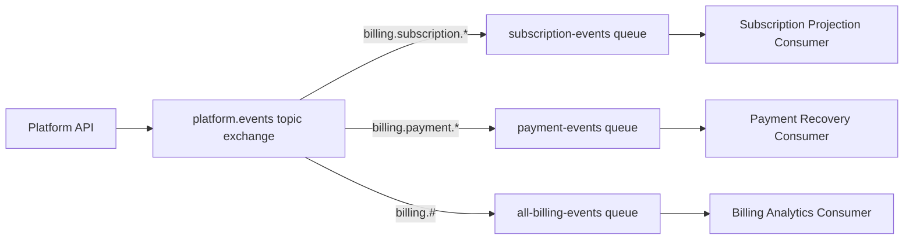

# Topic Exchange Example

A topic exchange routes messages by matching routing keys against patterns.

It is useful when consumers want to subscribe to a family of events instead of
one exact routing key.

## Business Scenario

Imagine a billing platform that publishes events from multiple domains:

- subscriptions;
- payments;
- invoices;
- audit logs.

Some consumers only care about one event. Other consumers care about a broader
category, such as every billing event or every payment event.

## Routing Key Convention

A predictable routing key convention makes topic exchanges easier to maintain.

Example format:

```text
<domain>.<aggregate>.<event>
```

Example routing keys:

- `billing.subscription.created`;
- `billing.subscription.canceled`;
- `billing.payment.failed`;
- `billing.invoice.generated`;
- `audit.organization.created`.

## Topic Wildcards

Topic exchanges support two important wildcard symbols:

- `*` matches exactly one word;
- `#` matches zero or more words.

Examples:

```text
billing.subscription.*
```

Matches:

- `billing.subscription.created`;
- `billing.subscription.canceled`.

Does not match:

- `billing.payment.failed`;
- `billing.subscription.trial.started`.

```text
billing.#
```

Matches:

- `billing.subscription.created`;
- `billing.payment.failed`;
- `billing.invoice.generated`.

## Topology

```text
Exchange: platform.events
Type: topic

Queue: subscription-events.queue
Binding key: billing.subscription.*

Queue: payment-events.queue
Binding key: billing.payment.*

Queue: all-billing-events.queue
Binding key: billing.#
```

## Message Flow



## Why Topic Exchange Fits

Use a topic exchange when:

- multiple consumers need different event scopes;
- routing keys follow a clear naming convention;
- consumers may subscribe to event families;
- adding new event types should not require rewriting every binding.

Avoid using a topic exchange when:

- exact routing is simpler and enough;
- routing keys are inconsistent;
- wildcard bindings would become too broad;
- message contracts are unclear.

## Spring Boot Configuration Shape

```java
@Bean
TopicExchange platformEventsExchange() {
    return new TopicExchange("platform.events");
}

@Bean
Queue subscriptionEventsQueue() {
    return QueueBuilder.durable("subscription-events.queue").build();
}

@Bean
Binding subscriptionEventsBinding(
        Queue subscriptionEventsQueue,
        TopicExchange platformEventsExchange
) {
    return BindingBuilder
            .bind(subscriptionEventsQueue)
            .to(platformEventsExchange)
            .with("billing.subscription.*");
}
```

## Design Considerations

Topic exchanges are powerful, but they require naming discipline.

Before introducing one, decide:

- which routing key format the team will use;
- whether event names are past-tense domain events;
- which consumers need exact events;
- which consumers need wildcard subscriptions;
- how broad wildcard bindings will be monitored.

## Interview Talking Points

- Topic exchange supports wildcard routing.
- `*` matches one word and `#` matches zero or more words.
- Routing key naming conventions are part of system design.
- Topic exchanges help when consumers need event categories.
- Overly broad wildcard bindings can make systems harder to reason about.
